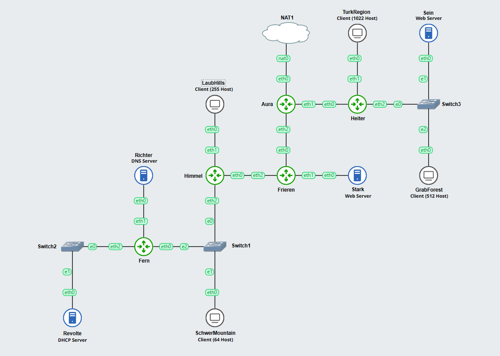

# Jarkom-Modul-5-D22-2023

## Anggota

| NRP | Name |
| --- | --- |
| 5025211016 | Thomas Juan Mahardika Suryono |
| 5025211015 | Muhammad Daffa Ashdaqfillah |

## Daftar Isi
- [Konfigurasi Subnetting](#topologi-gns3)
    - [Topologi GNS3](#topologi-gns3)
    - [Pembagian Rute Subnet](#pembagian-rute-subnet)
    - [Tree VLSM](#tree-vlsm)
    - [Pembagian IP subnet](#pembagian-ip-subnet)
    - [Konfigurasi Subnetting](#konfigurasi-subnetting)
    - [Konfigurasi DHCP](#konfigurasi-dhcp)
- [Penyelesaian Soal](#soal-1)
    - [Soal 1](#soal-1)
    - [Soal 2](#soal-2)
    - [Soal 3](#soal-3)
    - [Soal 4](#soal-4)
    - [Soal 5](#soal-5)
    - [Soal 6](#soal-6)
    - [Soal 7](#soal-7)
    - [Soal 8](#soal-8)
    - [Soal 9](#soal-9)
    - [Soal 10](#soal-10)

## Topologi GNS3



## Pembagian Rute Subnet


| Nama Subnet | Rute | Jumlah IP | Netmask |
| --- | --- | --- | --- |
| A1 | Aura-Heiter | 2 | /30 |
| A2 | Heiter-TurkRegion | 1023 | /21 |
| A3 | Heiter-Switch3-Sein&GrobeForest | 514 | /22 |
| A4 | Aura-Frieren | 2 | /30 |
| A5 | Frieren-Stark | 2 | /30 |
| A6 | Frieren-Himmel | 2 | /30 |
| A7 | Himmel-LaubHills | 256 | /23 |
| A8 | Himmel-Switch1-Fern&SchwerMountain | 66 | /25 |
| A9 | Fern-Ritcher | 2 | /30 |
| A10 | Fern-Switch2-Revolte | 2 | /30 |
| Total |  | 1871 | /20 |

## Tree VLSM


## Pembagian IP subnet

| Subnet | Network ID | Netmask | Broadcast |
| --- | --- | --- | --- |
| A1 | 192.202.1.124 | 255.255.255.252 | 192.202.1.127 |
| A2 | 192.202.8.0 | 255.255.248.0 | 192.202.15.255 |
| A3 | 192.202.4.0 | 255.255.252.0 | 192.202.7.255 |
| A4 | 192.202.1.120 | 255.255.255.252 | 192.202.1.123 |
| A5 | 192.202.1.116 | 255.255.255.252 | 192.202.1.119 |
| A6 | 192.202.1.112 | 255.255.255.252 | 192.202.1.115 |
| A7 | 192.202.2.0 | 255.255.254.0 | 192.202.3.255 |
| A8 | 192.202.1.128 | 255.255.255.128 | 192.202.1.255 |
| A9 | 192.202.1.108 | 255.255.255.252 | 192.202.1.111 |
| A10 | 192.202.1.104 | 255.255.255.252 | 192.202.1.107 |

## Konfigurasi Subnetting

- Aura
    
    ```
    auto eth0
    iface eth0 inet dhcp
    
    auto eth1
    iface eth1 inet static
    	address 192.202.1.125
    	netmask 255.255.255.252
    
    auto eth2
    iface eth2 inet static
    	address 192.202.1.121
    	netmask 255.255.255.252
    
    # eth1
    up route add -net 192.202.8.0 netmask 255.255.248.0 gw 192.202.1.126
    up route add -net 192.202.4.0 netmask 255.255.252.0 gw 192.202.1.126
    
    # eth2
    up route add -net 192.202.1.116 netmask 255.255.255.252 gw 192.202.1.122
    up route add -net 192.202.1.112 netmask 255.255.255.252 gw 192.202.1.122
    up route add -net 192.202.2.0 netmask 255.255.254.0 gw 192.202.1.122
    up route add -net 192.202.1.128 netmask 255.255.255.128 gw 192.202.1.122
    up route add -net 192.202.1.108 netmask 255.255.255.252 gw 192.202.1.122
    up route add -net 192.202.1.104 netmask 255.255.255.252 gw 192.202.1.122
    ```
    
- Heiter
    
    ```
    auto eth0
    iface eth0 inet static
    	address 192.202.1.126
    	netmask 255.255.255.252
    	gateway 192.202.1.125
    
    auto eth1
    iface eth1 inet static
    	address 192.202.8.1
    	netmask 255.255.248.0
    
    auto eth2
    iface eth2 inet static
    	address 192.202.4.1
    	netmask 255.255.252.0
    
    up echo nameserver 192.168.122.1 > /etc/resolv.conf
    ```
    
- Frieren
    
    ```
    auto eth0
    iface eth0 inet static
    	address 192.202.1.122
    	netmask 255.255.255.252
    	gateway 192.202.1.121
    
    auto eth1
    iface eth1 inet static
    	address 192.202.1.117
    	netmask 255.255.255.252
    
    auto eth2
    iface eth2 inet static
    	address 192.202.1.113
    	netmask 255.255.255.252
    
    up echo nameserver 192.168.122.1 > /etc/resolv.conf
    
    # eth2
    up route add -net 192.202.2.0 netmask 255.255.254.0 gw 192.202.1.114
    up route add -net 192.202.1.128 netmask 255.255.255.128 gw 192.202.1.114
    up route add -net 192.202.1.108 netmask 255.255.255.252 gw 192.202.1.114
    up route add -net 192.202.1.104 netmask 255.255.255.252 gw 192.202.1.114
    ```
    
- Himmel
    
    ```
    auto eth0
    iface eth0 inet static
    	address 192.202.1.114
    	netmask 255.255.255.252
    	gateway 192.202.1.113
    
    auto eth1
    iface eth1 inet static
    	address 192.202.2.1
    	netmask 255.255.254.0
    
    auto eth2
    iface eth2 inet static
    	address 192.202.1.129
    	netmask 255.255.255.128
    
    up echo nameserver 192.168.122.1 > /etc/resolv.conf
    
    # eth2
    up route add -net 192.202.1.108 netmask 255.255.255.252 gw 192.202.1.130
    up route add -net 192.202.1.104 netmask 255.255.255.252 gw 192.202.1.130
    ```
    
- Fern
    
    ```
    auto eth0
    iface eth0 inet static
    	address 192.202.1.130
    	netmask 255.255.255.128
    	gateway 192.202.1.129
    
    auto eth1
    iface eth1 inet static
    	address 192.202.1.109
    	netmask 255.255.255.252
    
    auto eth2
    iface eth2 inet static
    	address 192.202.1.105
    	netmask 255.255.255.252
    
    up echo nameserver 192.168.122.1 > /etc/resolv.conf
    ```
    
- Ritcher (DNS Server)
    
    ```
    auto eth0
    iface eth0 inet static
    	address 192.202.1.110
    	netmask 255.255.255.252
    	gateway 192.202.1.109
    
    up echo nameserver 192.168.122.1 > /etc/resolv.conf
    ```
    
- Revolte (DHCP Server)
    
    ```
    auto eth0
    iface eth0 inet static
    	address 192.202.1.106
    	netmask 255.255.255.252
    	gateway 192.202.1.105
    
    up echo nameserver 192.168.122.1 > /etc/resolv.conf
    ```
    
- Sein (Web Server)
    
    ```
    auto eth0
    iface eth0 inet static
    	address 192.202.4.2
    	netmask 255.255.252.0
    	gateway 192.202.4.1
    
    up echo nameserver 192.168.122.1 > /etc/resolv.conf
    ```
    
- Stark (Web Server)
    
    ```
    auto eth0
    iface eth0 inet static
    	address 192.202.1.118
    	netmask 255.255.255.252
    	gateway 192.202.1.117
    
    up echo nameserver 192.168.122.1 > /etc/resolv.conf
    ```
    
- TurkRegion (1022 Host)
    
    ```
    auto eth0
    iface eth0 inet dhcp
    	gateway 192.202.8.1
    
    up echo nameserver 192.168.122.1 > /etc/resolv.conf
    ```
    
- GrobeForest (512 Host)
    
    ```
    auto eth0
    iface eth0 inet dhcp
            gateway 192.202.4.1
    
    up echo nameserver 192.168.122.1 > /etc/resolv.conf
    ```
    
- LaubHills (255 Host)
    
    ```
    auto eth0
    iface eth0 inet dhcp
    	gateway 192.202.2.1
    
    up echo nameserver 192.168.122.1 > /etc/resolv.conf
    ```
    
- SchwerMountain (64 Host)
    
    ```
    auto eth0
    iface eth0 inet dhcp
    	gateway 192.202.1.129
    
    up echo nameserver 192.168.122.1 > /etc/resolv.conf
    ```
    

## Konfigurasi DHCP

Sebelum setup DHCP Server dan Relay, pastikan setiap node sudah terkoneksi dengan internet. Untuk keperluan setup, menggunakan iptables pada Aura

```sql
ETH0_IP=$(ip -4 addr show eth0 | grep -oP '(?<=inet\s)\d+(\.\d+){3}')
iptables -t nat -A POSTROUTING -o eth0 -j SNAT --to-source $ETH0_IP -s 192.202.8.0/20
```

### **DHCP Server (Revolte)**

- dhcp.conf
    
    ```
    # A1
    subnet 192.202.1.124 netmask 255.255.255.252 {
    }
    
    # A2
    subnet 192.202.8.0 netmask 255.255.248.0 {
        range 192.202.8.2 192.202.15.254;
        option routers 192.202.8.1;
        option broadcast-address 192.202.15.255;
        option domain-name-servers 192.202.1.110;
        default-lease-time 180;
        max-lease-time 5760;
    }
    
    # A3
    subnet 192.202.4.0 netmask 255.255.252.0 {
        range 192.202.4.3 192.202.7.254;
        option routers 192.202.4.1;
        option broadcast-address 192.202.7.255;
        option domain-name-servers 192.202.1.110;
        default-lease-time 180;
        max-lease-time 5760;
    }
    
    # A4
    subnet 192.202.1.120 netmask 255.255.255.252 {
    }
    
    # A5
    subnet 192.202.1.116 netmask 255.255.255.252 {
    }
    
    # A6
    subnet 192.202.1.112 netmask 255.255.255.252 {
    }
    
    # A7
    subnet 192.202.2.0 netmask 255.255.254.0 {
        range 192.202.2.2 192.202.3.254;
        option routers 192.202.2.1;
        option broadcast-address 192.202.3.255;
        option domain-name-servers 192.202.1.110;
        default-lease-time 180;
        max-lease-time 5760;
    }
    
    # A8
    subnet 192.202.1.128 netmask 255.255.255.128 {
        range 192.202.1.131 192.202.1.254;
        option routers 192.202.1.129;
        option broadcast-address 192.202.1.255;
        option domain-name-servers 192.202.1.110;
        default-lease-time 180;
        max-lease-time 5760;
    }
    
    # A9
    subnet 192.202.1.108 netmask 255.255.255.252 {
    }
    
    # A10
    subnet 192.202.1.104 netmask 255.255.255.252 {
    }
    ```
    
- isc-dhcp-server
    
    ```
    INTERFACESv4="eth0"
    ```
    
- setup
    
    ```
    apt-get update
    apt-get install isc-dhcp-server
    
    cp dhcpd.conf /etc/dhcp/
    cp isc-dhcp-server /etc/default/
    rm /var/run/dhcpd.pid
    service isc-dhcp-server restart
    ```
    

### **DHCP Relay (Fern, Himmel, Frieren, Aura, Heiter)**

- isc-dhcp-relay
    
    ```
    SERVERS="192.202.1.106"
    INTERFACES="eth0 eth1 eth2"
    OPTIONS=
    ```
    
- sysctl.conf
    
    ```
    net.ipv4.ip_forward=1
    ```
    
- setup
    
    ```
    apt-get update
    apt-get install isc-dhcp-relay -yservice isc-dhcp-relay start
    
    cp sysctl.conf /etc/
    cp isc-dhcp-relay /etc/default/
    service isc-dhcp-relay restart
    ```
    

### Telnet Node

```
# Aura
telnet 192.168.0.3  5001

# Heiter
telnet 192.168.0.3  5003

# Himmel
telnet 192.168.0.3  5016

# Fern
telnet 192.168.0.3  5023

# Frieren
telnet 192.168.0.3  5012

# Revolte
telnet 192.168.0.3  5028

# Richter
telnet 192.168.0.3  5025

# Sein
telnet 192.168.0.3  5032

# Stark
telnet 192.168.0.3  5030

# SchwerMountain
telnet 192.168.0.3  5021

# GrobeForest
telnet 192.168.0.3  5010

# LaubHills
telnet 192.168.0.3  5019

# TurkRegion
telnet 192.168.0.3  5005
```

---

## Soal 1

> Agar topologi yang kalian buat dapat mengakses keluar, kalian diminta untuk mengkonfigurasi Aura menggunakan iptables, tetapi tidak ingin menggunakan MASQUERADE.
> 

### Solusi

Pada node Aura, tambahkan konfigurasi sebagai berikut

```sql
ETH0_IP=$(ip -4 addr show eth0 | grep -oP '(?<=inet\s)\d+(\.\d+){3}')
iptables -t nat -A POSTROUTING -o eth0 -j SNAT --to-source $ETH0_IP -s 192.202.0.0/20
```
Keterangan

- **-t nat** menunjukkan bahwa aturan yang dibuat akan berada pada tabel NAT.
- **-A POSTROUTING** menunjukkan bahwa aturan yang dibuat akan diletakkan pada chain POSTROUTING.
- **-o eth0** menunjukkan bahwa paket yang akan dikenai aturan ini adalah paket yang keluar melalui interface eth0.
- **-j SNAT** menunjukkan bahwa paket yang dikenai aturan ini akan mengalami perubahan source address.
- **--to-source $ETH0_IP** menunjukkan bahwa source address dari paket yang dikenai aturan ini akan diubah menjadi IP address dari interface eth0.
- **-s 192.202.0.0/20** menunjukkan bahwa paket yang dikenai aturan ini adalah paket yang berasal dari semua subnet

### **Screenshot Hasil (ping google.com)**

- Router
    
    
    
- Server
    
    
    
- Client
    
    
    

---

## Soal 2

> Kalian diminta untuk melakukan drop semua TCP dan UDP kecuali port 8080 pada TCP.
> 

### Solusi

Pada Client, tambahkan konfigurasi ini

```sql
iptables -A INPUT -p tcp ! --dport 8080 -j DROP
iptables -A INPUT -p tcp --dport 8080 -j ACCEPT
iptables -A INPUT -p udp -j DROP
```

Keterangan

- Paket TCP yang bukan menuju port 8080 akan ditolak.
- Paket TCP yang menuju port 8080 akan diterima.
- Paket UDP akan ditolak.

### Testing

- Client
    
    ```sql
    apt-get update
    apt-get install netcat
    ```
    
- Sender
    
    ```sql
    # TCP Port 8080
    nc 192.202.4.13 8080
    
    # TCP Port 8000
    nc 192.202.4.13 8000
    
    # UDP Port 8080
    nc -u 192.202.4.13 8080
    ```
    
- Receiver
    
    ```sql
    # TCP Port 8080
    nc -l -p 8080
    
    # TCP Port 8000
    nc -l -p 8000
    
    # UDP Port 8080
    nc -u -l -p 8080
    ```
    

### **Screenshot Hasil (Kanan Sender, Kiri Receiver)**

- TCP Port 8080
    
    
    
- TCP Port 8000
    
    
    
- UDP Port 8080
    
    
    

---

## Soal 3

> Kepala Suku North Area meminta kalian untuk membatasi DHCP dan DNS Server hanya dapat dilakukan ping oleh maksimal 3 device secara bersamaan, selebihnya akan di drop.
> 

### Solusi

Pada DNS dan DHCP server (Revolte Richter) lakukan konfigurasi iptables sebagai berikut

```sql
iptables -A INPUT -m state --state ESTABLISHED,RELATED -j ACCEPT
iptables -A INPUT -p icmp -m connlimit --connlimit-above 3 --connlimit-mask 0 -j DROP
```

Keterangan

- **--connlimit-above 3** maka paket ICMP selanjutnya akan ditolak (**`DROP`**) dari alamat sumber tersebut. **`-`**
- **--connlimit-mask 0** menunjukkan bahwa pengecekan jumlah koneksi dilakukan berdasarkan alamat IP sumber secara langsung.

### **Screenshot Hasil**

- Ping DNS Server (Revolte)
    
    
    
    Node TurkRegion tidak mendapatkan paket data
    
- Ping DNS Server (Revolte)
    
    
    
    Node SchewerMountain tidak mendapatkan paket data
    

---

## Soal 4

> Lakukan pembatasan sehingga koneksi SSH pada Web Server hanya dapat dilakukan oleh masyarakat yang berada pada GrobeForest.
> 

### Solusi

Pada Web Server (Sein dan Stark) lakukan konfigurasi berikut

```sql
iptables -A INPUT -p tcp --dport 22 -s 192.202.4.4/22 -j ACCEPT
iptables -A INPUT -p tcp --dport 22 -j DROP
```
Keterangan
 
- `iptables -A INPUT -p tcp --dport 22 -s 192.202.4.4/22 -j ACCEPT`  menunjukkan bahwa paket TCP yang menuju port 22 akan diterima jika berasal dari subnet 192.202.4.4/22 (IP GrobeForest).
- `iptables -A INPUT -p tcp --dport 22 -j DROP` menunjukkan bahwa paket TCP yang menuju port 22 akan ditolak.

### Testing

```sql
nmap 192.202.1.118 22
```

```sql
nc -l -p 22

nc 192.202.1.118 22
nc 192.202.4.2 22
```

### **Screenshot Hasil**

- Hasil nmap
    
    
    
    Pada node selain GrobeForest untuk port 22/tcp (ssh) state nya Filtered
    Pada node GrobeForest untuk port 22/tcp (ssh) state nya open
    
- Hasil netcat
    
    
    
    Pada node GrobeForest berhasil bind ke Stark
    Pada node LaubHills ngga bisa bind ke Sein
    

---

## Soal 5

> Selain itu, akses menuju WebServer hanya diperbolehkan saat jam kerja yaitu Senin-Jumat pada pukul 08.00-16.00.
> 

### Solusi

Pada Web Server (Sein dan Stark) tambahkan konfigurasi berikut

```sql
iptables -A INPUT -p tcp --dport 22 -m time --weekdays Mon,Tue,Wed,Thu,Fri --timestart 08:00 --timestop 16:00 -s -j ACCEPT
iptables -A INPUT -j DROP
```
Keterangan
- `iptables -A INPUT -p tcp --dport 22 -m time --weekdays Mon,Tue,Wed,Thu,Fri --timestart 08:00 --timestop 16:00 -s -j ACCEPT` menunjukkan bahwa paket TCP yang menuju port 22 akan diterima dalam jangka waktu Senin-Jumat pada pukul 08.00-16.00.
- `iptables -A INPUT -j DROP` menunjukkan bahwa paket TCP yang menuju port 22 selain waktu sebelumnya akan ditolak.

### Testing

- Rubah Date pada node untuk hak akses
    
    ```sql
    # Monday, 18 December 2023 09:00
    date 121809002023
    
    # Monday, 18 December 2023 17:00
    date 121817002023
    
    # Sunday, 17 December 2023 09:00
    date 121709002023
    ```
    
- Lakukan nmap
    
    ```sql
    nmap 192.202.1.118 22
    ```
    

### **Screenshot Hasil**

- Monday, 18 December 09.00 (open)
    
    
    
- Monday, 18 December 17.00 (filtered)
    
    
    
- Sunday, 17 December 09.00 (filtered)
    
    
    

---

## Soal 6

> Lalu, karena ternyata terdapat beberapa waktu di mana network administrator dari WebServer tidak bisa stand by, sehingga perlu ditambahkan rule bahwa akses pada hari Senin - Kamis pada jam 12.00 - 13.00 dilarang (istirahat maksi cuy) dan akses di hari Jumat pada jam 11.00 - 13.00 juga dilarang (maklum, Jumatan rek).
> 

### Solusi

Pada Web Server (Sein dan Stark) tambahkan konfigurasi berikut

```sql
iptables -A INPUT -p tcp --dport 22 -m time --weekdays Mon,Tue,Wed,Thu --timestart 12:00 --timestop 13:00 -j DROP
iptables -A INPUT -p tcp --dport 22 -m time --weekdays Fri --timestart 11:00 --timestop 13:00 -j DROP
```
Keterangan
- `iptables -A INPUT -p tcp --dport 22 -m time --weekdays Mon,Tue,Wed,Thu --timestart 12:00 --timestop 13:00 -j DROP` menunjukkan bahwa paket TCP yang menuju port 22 akan ditolak dalam jangka waktu Senin-Kamis pada pukul 12.00-13.00.
- `iptables -A INPUT -p tcp --dport 22 -m time --weekdays Fri --timestart 11:00 --timestop 13:00 -j DROP` menunjukkan bahwa paket TCP yang menuju port 22 akan ditolak dalam jangka waktu Jumat pada pukul 11.00-13.00.

### Testing

- Rubah Date pada node untuk hak akses
    
    ```sql
    # Monday, 18 December 2023 09:00
    date 121809002023
    
    # Monday, 18 December 2023 12:30
    date 121812302023
    
    # Friday, 22 December 2023 09:00
    date 122209002023
    
    # Friday, 22 December 2023 12:00
    date 122212002023
    ```
    
- Lakukan nmap
    
    ```sql
    nmap 192.202.1.118 22
    ```
    

### **Screenshot Hasil**

- Monday, 18 December 2023 09.00 (open)
    
    
    
- Monday, 18 December 2023 12.30 (filtered)
    
    
    
- Friday, 22 December 2023 09.00 (open)
    
    
    
- Friday, 22 December 2023 12.00 (filtered)
    
    
    

---

## Soal 7

> Karena terdapat 2 WebServer, kalian diminta agar setiap client yang mengakses Sein dengan Port 80 akan didistribusikan secara bergantian pada Sein dan Stark secara berurutan dan request dari client yang mengakses Stark dengan port 443 akan didistribusikan secara bergantian pada Sein dan Stark secara berurutan.
> 

### Solusi

Initialisasi Web Server

```sql
apt-get install -y apache2

echo "dari [nama node]" > /var/www/html/index.html

# Konfigurasi virtual host di Apache
echo "
<VirtualHost *:80>
    ServerName 192.202.[ip node]
    DocumentRoot /var/www/html
    ErrorLog \${APACHE_LOG_DIR}/error.log
    CustomLog \${APACHE_LOG_DIR}/access.log combined
</VirtualHost>
<VirtualHost *:443>
    ServerName 192.202.[ip node]
    DocumentRoot /var/www/html
    ErrorLog \${APACHE_LOG_DIR}/error.log
    CustomLog \${APACHE_LOG_DIR}/access.log combined
</VirtualHost>
" > /etc/apache2/sites-available/192.202.4.2.conf

echo '
Listen 80
Listen 443

<IfModule ssl_module>
        Listen 443
</IfModule>

<IfModule mod_gnutls.c>
        Listen 443
</IfModule>
' > /etc/apache2/ports.conf

a2ensite 192.202.4.2.conf
service restart apache2
```

Tambahkan konfigurasi ini pada Router

```sql
iptables -A PREROUTING -t nat -p tcp -d 192.202.4.2 --dport 80 -m statistic --mode nth --every 2 --packet 0 -j DNAT --to-destination 192.202.4.2:80
iptables -A PREROUTING -t nat -p tcp -d 192.202.4.2 --dport 80 -j DNAT --to-destination 192.202.1.118:80

iptables -A PREROUTING -t nat -p tcp -d 192.202.1.118 --dport 443 -m statistic --mode nth --every 2 --packet 0 -j DNAT --to-destination 192.202.1.118:443
iptables -A PREROUTING -t nat -p tcp -d 192.202.1.118 --dport 443 -j DNAT --to-destination 192.202.4.2:443
```
Keterangan
- Aturan pertama: Setiap paket yang masuk ke alamat IP 192.202.4.2 dengan port 80 akan diarahkan ke alamat IP 192.202.4.2:80 secara bergantian setiap kedua paket. Ini akan membagi beban antara Sein (192.202.4.2:80) dan Stark (192.202.1.118:80).
- Aturan kedua: Semua paket yang masih tiba di 192.202.4.2:80 akan dialihkan ke 192.202.1.118:80. Ini menjamin bahwa ada distribusi antara kedua server tersebut.
- Aturan ketiga: Setiap paket yang masuk ke alamat IP 192.202.1.118 dengan port 443 akan diarahkan ke alamat IP 192.202.1.118:443 secara bergantian setiap kedua paket. Ini akan membagi beban antara Sein (192.202.1.118:443) dan Stark (192.202.4.2:443).
- Aturan keempat: Semua paket yang masih tiba di 192.202.1.118:443 akan dialihkan ke 192.202.4.2:443. Ini juga menjamin distribusi beban antara kedua server.

### Testing

Lakukan curl untuk mendapatkan hasil dari setiap webserver

```sql
curl 192.202.4.2:80
curl 192.202.4.2:80

curl 192.202.1.118:443
curl 192.202.1.118:443
```

### **Screenshot Hasil**

---

- Curl 192.202.4.2:80
    
    
    
- Curl 192.202.1.118:443 (terdaoat eror dalam curl port HTTPS)
    
    
    
- Karena terdapat eror pada curl, kami mengetes menggunakan netcat dengan dua client dan webserver yang mendengarkan port 443
    
    
    
    Untuk pengaksesan `nc 192.202.1.118 443` pertama pada TurkRegion diarahkan ke stark, selanjutnya `nc 192.202.1.118 443` kedua pada LaubHills akan diarahkan ke sein
    

## Soal 8

> Karena berbeda koalisi politik, maka subnet dengan masyarakat yang berada pada Revolte dilarang keras mengakses WebServer hingga masa pencoblosan pemilu kepala suku 2024 berakhir. Masa pemilu (hingga pemungutan dan penghitungan suara selesai) kepala suku bersamaan dengan masa pemilu Presiden dan Wakil Presiden Indonesia 2024
> 

### Solusi

Pada Web Server (Sein dan Stark) lakukan konfigurasi berikut

```sql
iptables -A INPUT -p tcp -s 192.202.1.104/30 --dport 80 -m time --datestart 2023-10-19 --datestop 2024-02-15 -j DROP
```
Keterangan
- `iptables -A INPUT -p tcp -s 192.202.1.104/30 --dport 80 -m time --datestart 2023-10-19 --datestop 2024-02-15 -j DROP` menunjukkan bahwa paket TCP yang menuju port 80 akan ditolak jika diakses pada waktu 2023-10-19 hingga 2024-02-15.

### Testing

- Rubah Date pada node untuk hak akses
    
    ```sql
    # Monday, 18 December 2023 09:00
    date 121809002023
    
    # Monday, 18 December 2024 09:00
    date 121809002024
    ```
    
- Lakukan nc pada webserver stark (listen) dan revolte (sender)
    
    ```sql
    nc -l -p 80
    nc 192.202.1.118 80
    ```
    

### **Screenshot Hasil**

- Monday, 18 December 2023 09.00 (masa pemilu - data tidak masuk)
    
    
    
- Monday, 18 December 2024 09.00 (di luar masa pemilu - data berhasil masuk)
    
    
    

---

## Soal 9

> Sadar akan adanya potensial saling serang antar kubu politik, maka WebServer harus dapat secara otomatis memblokir alamat IP yang melakukan scanning port dalam jumlah banyak (maksimal 20 scan port) di dalam selang waktu 10 menit. (clue: test dengan nmap)
> 

### Solusi

Pada Web Server (Sein dan Stark) lakukan konfigurasi berikut

```sql
iptables -N portscan

iptables -A INPUT -m recent --name portscan --update --seconds 600 --hitcount 20 -j DROP
iptables -A FORWARD -m recent --name portscan --update --seconds 600 --hitcount 20 -j DROP

iptables -A INPUT -m recent --name portscan --set -j ACCEPT
iptables -A FORWARD -m recent --name portscan --set -j ACCEPT
```
Keterangan
- `iptables -N portscan` menunjukkan bahwa akan dibuat chain baru bernama portscan.
- `iptables -A INPUT -m recent --name portscan --update --seconds 600 --hitcount 20 -j DROP` menunjukkan bahwa paket yang masuk akan ditolak jika alamat IP sumber sudah melakukan scanning port dalam jumlah 20 kali dalam waktu 10 menit.
- `iptables -A FORWARD -m recent --name portscan --update --seconds 600 --hitcount 20 -j DROP` menunjukkan bahwa paket yang akan diteruskan ke node lain akan ditolak jika alamat IP sumber sudah melakukan scanning port dalam jumlah 20 kali dalam waktu 10 menit.
- `iptables -A INPUT -m recent --name portscan --set -j ACCEPT` menunjukkan bahwa paket yang masuk akan diterima jika alamat IP sumber belum melakukan scanning port dalam jumlah 20 kali dalam waktu 10 menit.
- `iptables -A FORWARD -m recent --name portscan --set -j ACCEPT` menunjukkan bahwa paket yang akan diteruskan ke node lain akan diterima jika alamat IP sumber belum melakukan scanning port dalam jumlah 20 kali dalam waktu 10 menit.

### Testing

Pada node Client (GrobeForest) lakukan ping sebanyak 30 paket ke webserver

```sql
ping 192.202.1.118 -c 30
```

### **Screenshot Hasil**

- Dari hasil ping 30 paket yang dilakukan ke webserver, hanya 20 paket yang diterima
    
    
    

---

## Soal 10

> Karena kepala suku ingin tau paket apa saja yang di-drop, maka di setiap node server dan router ditambahkan logging paket yang di-drop dengan standard syslog level.
> 

### Solusi

```sql
iptables -N LOGGING
iptables -A INPUT -j LOGGING
iptables -A LOGGING -j LOG --log-prefix "DROP: "
iptables -A LOGGING -j REJECT

echo'
kern.warning /var/log/iptables.log
' >> /etc/rsyslog.conf

/etc/init.d/rsyslog restart
```
Keterangan
- `iptables -N LOGGING` menunjukkan bahwa akan dibuat chain baru bernama LOGGING.
- `iptables -A INPUT -j LOGGING` menunjukkan bahwa paket yang masuk akan diteruskan ke chain LOGGING.
- `iptables -A LOGGING -j LOG --log-prefix "DROP: "` menunjukkan bahwa paket yang masuk akan dicatat pada log dengan prefix DROP.
- `kern.warning /var/log/iptables.log` menunjukkan bahwa log dengan level warning akan dicatat pada file /var/log/iptables.log.
- `/etc/init.d/rsyslog restart` restart kembali rsyslog.

### **Screenshot Hasil**

---

## Kendala Pengerjaan

- Port ssh pada webserver sempat tidak aktif menjadikan testing nmap tidak sesuai
- NC saat ke port 22 terkadang lupa untuk menonaktifkan ssh terlebih dahulu